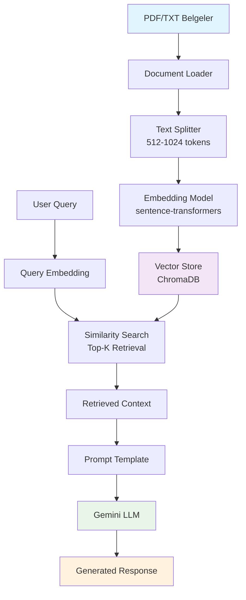

# RAG Tabanlı Chatbot Geliştirme Projesi 🤖

## Proje Genel Bakış

Bu proje, **Retrieval Augmented Generation (RAG)** mimarisini kullanarak kurumsal belgelere dayalı güvenilir ve doğrulanabilir yanıtlar üretebilen bir chatbot sistemi geliştirmeyi amaçlamaktadır. Sistem, kullanıcıların spesifik doküman setleri üzerinden soru sorabilecekleri ve bu dokümanlardan çıkarılan bilgilere dayanan yanıtlar alabileceği bir web arayüzü sunmaktadır.

### 🎯 Projenin Ana Amacı

Geleneksel LLM'lerin genel bilgi hallucination sorunlarını çözmek ve spesifik kurumsal bilgi kaynaklarına dayanan güvenilir bir bilgi erişim sistemi oluşturmak. Bu sistem:

- **Doğrulanabilir Yanıtlar**: Her yanıt kaynak belgeye referans verir
- **Güncel Bilgi**: Yeni dokümanlar kolayca sisteme entegre edilebilir  
- **Hallucination Kontrolü**: LLM sadece sağlanan bağlam üzerinden yanıt üretir
- **Özelleştirilmiş Bilgi Tabanı**: Spesifik domain knowledge'a odaklanır

---

## 📋 Proje Gereksinimleri ve Aşamalar

### Adım 1: Geliştirme Ortamı Kurulumu ✅

- **Python 3.8+** sanal ortam kurulumu
- **Gerekli Kütüphaneler**: LangChain, Streamlit, Vector Database, Embedding Models
- **API Erişimleri**: Gemini API key konfigürasyonu
- **Versiyon Kontrolü**: Git repository yapısı

### Adım 2: Veri Seti Hazırlama 📚

- **Veri Kaynağı Belirleme**: PDF, TXT, CSV formatında dokümanlar
- **Veri Kalitesi Kontrolü**: İçerik tutarlılığı ve format uyumluluğu
- **Chunking Stratejisi**: Optimal parça boyutu belirleme (512-1024 token)
- **Metadata Yönetimi**: Kaynak takibi ve kategorilendirme

### Adım 3: RAG Mimarisi Tasarımı 🏗️

- **Embedding Model Seçimi**: Türkçe desteği olan modeller önceliği
- **Vector Database**: Performans ve ölçeklenebilirlik kriterleri
- **Retrieval Stratejisi**: Semantic similarity ve hybrid search
- **Generation Pipeline**: Prompt engineering ve context management

### Adım 4: Web Arayüzü Geliştirme 💻

- **Frontend Framework**: Streamlit/Gradio ile kullanıcı dostu arayüz
- **Chat Interface**: Gerçek zamanlı soru-cevap akışı
- **Kaynak Referansları**: Yanıtların kaynak belge linklerini gösterme
- **Responsive Design**: Farklı cihazlarda uyumluluk

### Adım 5: Test ve Deploy 🚀

- **Functionality Testing**: RAG pipeline end-to-end testleri
- **Performance Testing**: Yanıt süresi ve accuracy metrikleri
- **User Experience Testing**: Arayüz kullanılabilirlik testleri
- **Production Deployment**: Cloud platform üzerinde yayınlama

---

## 🛠 Teknoloji Stack

### Core Framework
```python
# RAG Framework
langchain>=0.1.0
chromadb>=0.4.0

# LLM Integration  
google-generativeai>=0.3.0

# Web Framework
streamlit>=1.28.0
gradio>=4.0.0

# Data Processing
pandas>=2.0.0
numpy>=1.24.0
pypdf>=3.15.0
```

### Önerilen Teknoloji Seçimleri

| **Komponent** | **Önerilen Teknoloji** | **Alternatifler** | **Seçim Gerekçesi** |
|---------------|------------------------|-------------------|----------------------|
| **LLM** | Gemini 2.0 Flash | GPT-4, Claude | Ücretsiz API, Türkçe desteği, hızlı yanıt |
| **Embedding** | sentence-transformers | OpenAI Embeddings | Offline çalışma, maliyet etkinliği |
| **Vector DB** | ChromaDB | FAISS, Pinecone | Kolay kurulum, iyi performans |
| **Framework** | LangChain | LlamaIndex | Geniş ekosistem, community desteği |
| **Web UI** | Streamlit | Gradio, FastAPI | Hızlı prototipleme, deployment kolaylığı |

---

## 📊 RAG Pipeline Mimarisi



### Pipeline Detayları

#### 1. Document Processing
```python
# Belgeler 512-1024 token'lık parçalara ayrılır
# Overlap: %10-20 bilgi kaybını önlemek için
chunk_size = 1000
chunk_overlap = 200
```

#### 2. Embedding ve Indexing
```python
# Türkçe-İngilizce desteği olan model
model = "sentence-transformers/paraphrase-multilingual-MiniLM-L12-v2"
# ChromaDB'de persistent storage
collection = client.create_collection("documents")
```

#### 3. Retrieval Strategy
```python
# Semantic similarity + keyword matching
# Top-K: 3-5 en alakalı doküman parçası
similar_docs = vector_store.similarity_search(query, k=4)
```

#### 4. Generation
```python
# Structured prompt with context
prompt_template = """
Context: {context}
Question: {question}
Answer based only on the context above:
"""
```

---

## 🎨 Web Arayüzü Tasarımı

### Kullanıcı Deneyimi Akışı

1. **Giriş Sayfası**: Proje açıklaması ve kullanım kılavuzu
2. **Chat Interface**: Soru-cevap arayüzü
3. **Kaynak Referansları**: Her yanıt altında kaynak belge bilgileri
4. **Ayarlar**: Retrieval parametrelerini ayarlama (opsiyonel)

### Arayüz Bileşenleri

```python
# Streamlit bileşenleri
st.title("RAG Chatbot Assistant")
st.sidebar.markdown("### Doküman Bilgileri")
user_query = st.text_input("Sorunuzu yazın:")
if st.button("Gönder"):
    response = generate_response(user_query)
    st.markdown(response)
    st.markdown("**Kaynaklar:**")
    for source in sources:
        st.markdown(f"- {source}")
```

---

## 🧪 Test Senaryoları

### Functionality Tests

1. **Basic RAG Test**
   ```
   Query: "Şirket politikası nedir?"
   Expected: Yüklenen HR dokümanlarından spesifik politika bilgisi
   ```

2. **Source Citation Test**
   ```
   Query: "Çalışma saatleri hakkında bilgi ver"
   Expected: Yanıt + kaynak belge referansı
   ```

3. **Out-of-Scope Test**
   ```
   Query: "Hava durumu nasıl?"
   Expected: "Bu konu hakkında belgelerimde bilgi bulunamadı"
   ```

### Performance Metrics

- **Yanıt Süresi**: < 5 saniye
- **Relevance Score**: > 0.7 (similarity threshold)
- **Source Accuracy**: %95+ doğru kaynak atama

---

## 🚀 Deploy ve Çalıştırma

### Yerel Geliştirme

```bash
# Proje klonla
git clone https://github.com/username/rag-chatbot
cd rag-chatbot

# Sanal ortam oluştur
python -m venv venv
source venv/bin/activate  # Windows: venv\Scripts\activate

# Bağımlılıkları yükle
pip install -r requirements.txt

# Çevresel değişkenleri ayarla
cp .env.example .env
# GEMINI_API_KEY=your_api_key_here

# Uygulamayı çalıştır
streamlit run app.py
```

### Cloud Deployment

#### Streamlit Cloud
```bash
# requirements.txt ve secrets.toml hazırla
# GitHub repository'yi Streamlit Cloud'a bağla
# https://share.streamlit.io üzerinden deploy et
```

#### Hugging Face Spaces
```python
# app.py ve requirements.txt ile Gradio uygulaması
# Hugging Face Spaces'e upload et
# Otomatik deployment
```

---

## 📈 Proje Çıktıları ve Değerlendirme

### Teslim Edilecek Dosyalar

1. **README.md**: Kapsamlı proje dokümantasyonu
2. **app.py**: Ana Streamlit uygulaması
3. **requirements.txt**: Python bağımlılıkları
4. **notebooks/**: Geliştirme ve test notebook'ları
5. **data/**: Sample dokümanlar (eğer public ise)
6. **screenshots/**: Arayüz görüntüleri

### Demo ve Sunum

- **Live Demo**: Çalışan web uygulaması linki
- **Video Demo**: 3-5 dakikalık kullanım gösterimi
- **Technical Presentation**: Mimari ve teknik kararların sunumu

### Değerlendirme Kriterleri

1. **Teknik Uygulama** (40%): RAG pipeline kalitesi
2. **Web Arayüzü** (25%): UX/UI ve fonksiyonellik
3. **Dokümantasyon** (20%): README ve kod kalitesi
4. **Innovation** (15%): Özgün yaklaşımlar ve iyileştirmeler

---

## 🔗 Faydalı Kaynaklar ve Proje Referansları

### 🎓 Eğitim Materyalleri ve Örnekler

#### 1. **Kapsamlı RAG Tutorial - Kardel Rüveyda Çetin**
**Kaynak**: [Gemini ve LangChain Kullanarak RAG ile Chatbot Geliştirme](https://medium.com/dogus-teknoloji/gemini-ve-langchain-kullanarak-rag-ile-chatbot-geli%C5%9Ftirme-c6b6b03ad854)

**İçerik Özeti**:
- **Gemini Model Seçimi**: Gemini 1.5 Pro vs 2.0 Flash karşılaştırması
  - 2.0 Flash: 15 RPM, 1M TPM, 1,500 RPD - yüksek kullanım limiti
  - 1.5 Pro: 2 RPM, 32K TPM, 50 RPD - 1M token bağlam penceresi
- **Geliştirme Ortamı**: Python 3.10, Anaconda/Miniconda kurulumu
- **RAG Pipeline Adımları**:
  ```python
  # 1. PDF Yükleme
  from langchain_community.document_loaders import PyPDFLoader
  loader = PyPDFLoader("attentionisallyouneed.pdf")
  data = loader.load()
  
  # 2. Chunking (1000 karakter optimal)
  from langchain.text_splitter import RecursiveCharacterTextSplitter
  text_splitter = RecursiveCharacterTextSplitter(chunk_size=1000)
  docs = text_splitter.split_documents(data)
  
  # 3. Embedding (Google models/embedding-001)
  from langchain_google_genai import GoogleGenerativeAIEmbeddings
  embeddings = GoogleGenerativeAIEmbeddings(model="models/embedding-001")
  
  # 4. Vector Store (ChromaDB)
  from langchain_chroma import Chroma
  vectorstore = Chroma.from_documents(documents=docs, embedding=embeddings)
  
  # 5. Retrieval + Generation
  retriever = vectorstore.as_retriever(search_kwargs={"k": 10})
  llm = ChatGoogleGenerativeAI(model="gemini-1.5-pro", temperature=0.3)
  ```

**Teknik Detaylar**:
- Chunk boyutu neden 1000 karakter? Anlam bütünlüğü + performance dengesi
- Temperature 0.3: Daha az rastgele, daha tutarlı yanıtlar
- "Attention Is All You Need" makalesi örnek veri seti olarak kullanılmış

#### 2. **Pratik Örnek Repository**
**Kaynak**: [KardelRuveyda/gemini-devmultigroup-example](https://github.com/KardelRuveyda/gemini-devmultigroup-example)

**Repository İçeriği**:
- `gemini_basic_rag.ipynb`: Complete RAG implementation
- `app.py`: Streamlit web arayüzü
- `attentionisallyouneed.pdf`: Test dokümanı
- `requirements.txt`: Gerekli paketler

**Kullanım Kılavuzu**:
```bash
# Repository'yi klonla
git clone https://github.com/KardelRuveyda/gemini-devmultigroup-example.git

# Gerekli paketleri yükle
pip install -r requirements.txt

# Streamlit uygulamasını çalıştır
streamlit run app.py
```

#### 3. **Gelişmiş RAG Teknikleri Koleksiyonu**
**Kaynak**: [NirDiamant/RAG_Techniques](https://github.com/NirDiamant/RAG_Techniques)

**35+ İleri Seviye RAG Tekniği**:

| **Kategori** | **Teknik** | **Açıklama** |
|--------------|------------|--------------|
| **Foundational** | Simple RAG, CSV RAG | Temel RAG implementasyonları |
| **Query Enhancement** | HyDE, Query Transformations | Sorgu iyileştirme teknikleri |
| **Context Enrichment** | Semantic Chunking, Contextual Headers | İçerik zenginleştirme |
| **Advanced Retrieval** | Fusion Retrieval, Reranking | Gelişmiş geri getirme |
| **Iterative** | Adaptive Retrieval, Feedback Loops | Adaptif sistemler |
| **Evaluation** | DeepEval, GroUSE | Sistem değerlendirme |
| **Advanced Architecture** | GraphRAG, RAPTOR, Self-RAG | Mimari yaklaşımlar |

**Öne Çıkan Teknikler**:
- **HyDE (Hypothetical Document Embedding)**: Varsayımsal doküman embedding
- **GraphRAG**: Knowledge graph entegrasyonu
- **RAPTOR**: Recursive tree-organized retrieval
- **Corrective RAG**: Self-correcting retrieval

### 📚 API Dokümantasyonları

#### **Gemini API**
- **Ana Dokümantasyon**: [Gemini API Docs](https://ai.google.dev/gemini-api/docs?hl=tr)
- **API Key Alma**: [API Key Generation](https://ai.google.dev/gemini-api/docs/api-key)
- **Model Karşılaştırması**: Gemini 2.0 Flash vs 1.5 Pro
- **Pricing**: Ücretsiz tier limitleri ve kullanım kotaları

#### **Framework Dokümantasyonları**
- **LangChain**: [https://docs.langchain.com/](https://docs.langchain.com/)
  - RAG Chains, Document Loaders, Text Splitters
  - Vector Stores, Retrievers, Memory
- **Streamlit**: [https://docs.streamlit.io/](https://docs.streamlit.io/)
  - Chat Interface, File Upload, Session State
  - Deployment to Streamlit Cloud

#### **Vector Database Docs**
- **ChromaDB**: [https://docs.trychroma.com/](https://docs.trychroma.com/)
- **FAISS**: [https://faiss.ai/](https://faiss.ai/)
- **Pinecone**: [https://docs.pinecone.io/](https://docs.pinecone.io/)

### 🗂️ Dataset Kaynakları

#### **Türkçe Veri Setleri**
- **Turkish NLP Datasets**: [stefan-it/turkish-nlp-datasets](https://github.com/stefan-it/turkish-nlp-datasets)
- **Turkish Text Corpus**: Academic papers, news articles
- **TS Corpus**: Turkish Social Media Dataset

#### **Genel Veri Kaynakları**
- **Hugging Face Datasets**: [https://huggingface.co/datasets](https://huggingface.co/datasets)
  - PDF parsing için: `ms_marco`, `squad_v2`
  - Türkçe için: `turkish_news`, `tr_wikipedia`
- **Kaggle Datasets**: [https://www.kaggle.com/datasets](https://www.kaggle.com/datasets)
  - PDF documents collection
  - Q&A datasets for evaluation

#### **Örnek PDF Dokümanları**
- **Academic Papers**: arXiv.org scientific papers
- **Company Documents**: Annual reports, policies
- **Technical Manuals**: User guides, documentation
- **Legal Documents**: Contracts, regulations (anonymized)

### 🛠️ Development Tools ve Libraries

#### **Core RAG Stack**
```python
# Essential libraries for RAG development
langchain>=0.1.0              # RAG framework
langchain-community           # Additional integrations
langchain-google-genai       # Gemini API integration
chromadb>=0.4.0              # Vector database
sentence-transformers        # Embedding models
streamlit>=1.28.0            # Web framework
python-dotenv                # Environment variables
pypdf>=3.15.0                # PDF processing
```

#### **Advanced Libraries**
```python
# For advanced features
gradio>=4.0.0                # Alternative web UI
llamaindex                   # Alternative RAG framework
faiss-cpu                    # Alternative vector DB
transformers                 # HuggingFace models
torch                        # Deep learning backend
numpy>=1.24.0               # Numerical computing
pandas>=2.0.0               # Data manipulation
```

### 🎯 Proje Şablonları ve Başlangıç Kodları

#### **Minimal RAG Implementation**
```python
# app.py - Temel RAG Chatbot
import streamlit as st
import os
from langchain_google_genai import ChatGoogleGenerativeAI, GoogleGenerativeAIEmbeddings
from langchain_community.document_loaders import PyPDFLoader
from langchain.text_splitter import RecursiveCharacterTextSplitter
from langchain_chroma import Chroma
from langchain.chains import create_retrieval_chain
from langchain.chains.combine_documents import create_stuff_documents_chain
from langchain_core.prompts import ChatPromptTemplate

# Streamlit setup
st.set_page_config(page_title="RAG Chatbot", page_icon="🤖")
st.title("🤖 RAG Chatbot Assistant")

# API key setup
if "GEMINI_API_KEY" not in os.environ:
    api_key = st.text_input("Gemini API Key girin:", type="password")
    if api_key:
        os.environ["GEMINI_API_KEY"] = api_key

# File upload
uploaded_file = st.file_uploader("PDF dosyası yükleyin:", type="pdf")
if uploaded_file:
    # RAG pipeline implementation here
    pass
```

#### **Requirements.txt Template**
```txt
# RAG Chatbot Requirements
langchain==0.1.0
langchain-community
langchain-google-genai
langchain-chroma
streamlit>=1.28.0
pypdf>=3.15.0
python-dotenv
sentence-transformers
chromadb>=0.4.0
google-generativeai>=0.3.0
```

### 🔬 Evaluation ve Testing Araçları

#### **RAG Performance Metrics**
- **RAGAS**: RAG-specific evaluation framework
- **DeepEval**: Comprehensive LLM evaluation
- **LangSmith**: LangChain debugging and monitoring
- **Weights & Biases**: Experiment tracking

#### **Test Datasets**
- **MS MARCO**: Microsoft reading comprehension
- **Natural Questions**: Google Q&A dataset
- **SQuAD 2.0**: Stanford Q&A dataset
- **Turkish QA Dataset**: Türkçe soru-cevap seti

**Son Güncelleme**: 22 Ekim 2025  
**Kaynak Güncelleme**: Medium makalesi, GitHub repositories, resmi dokümantasyonlar

---

## 🎯 Proje Başarı Metrikleri

### Minimum Viable Product (MVP)
- ✅ Temel RAG pipeline çalışıyor
- ✅ Web arayüzü functional
- ✅ En az 3 test dokümanı ile demo
- ✅ GitHub repository düzenli

### Gelişmiş Özellikler (Bonus)
- 🚀 Multi-language support
- 🚀 Advanced retrieval (hybrid search)
- 🚀 Conversation memory
- 🚀 Admin panel (document management)

**Son Güncelleme**: 22 Ekim 2025  
**Proje Süresi**: 3-4 hafta  
**Zorluk Seviyesi**: Orta-İleri Seviye